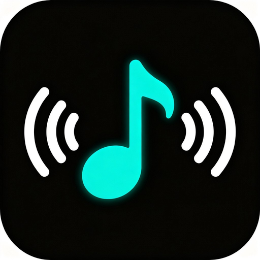
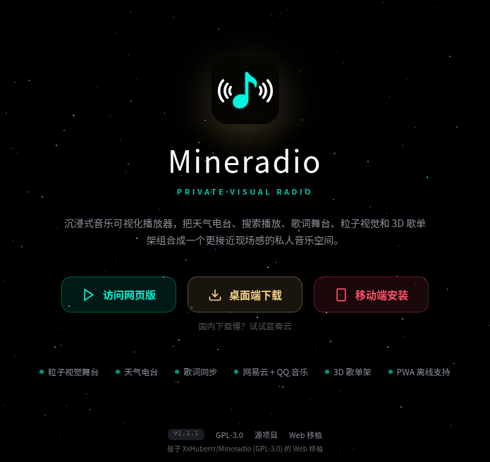
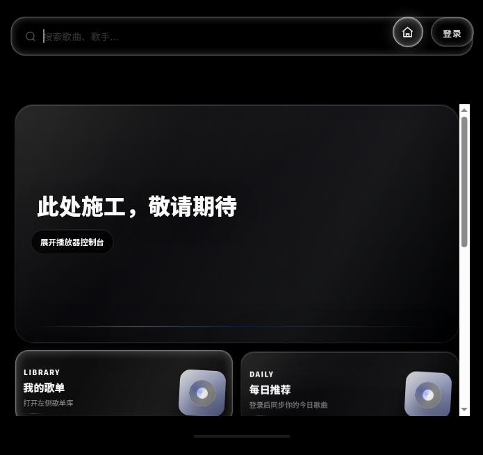

<div align="center">

[English](README.md) | [中文](README.zh-CN.md)



# Mineradio Web

### Immersive Music Visualization Player

A private music space that blends weather radio, search & playback, lyric stage, particle visuals, and a 3D playlist shelf into a live-concert-like experience.

[](LICENSE)
[](https://nodejs.org)
[](public/manifest.json)
[](tests/)
[](../../pulls)

**Live Demo**

[](https://mineradio-webapp.onrender.com/)
[](http://47.103.19.23:3000/app)

</div>

---

## Screenshots

<div align="center">
  <table>
    <tr>
      <td align="center"><b>Landing Page</b></td>
      <td align="center"><b>Player Interface</b></td>
    </tr>
    <tr>
      <td></td>
      <td></td>
    </tr>
  </table>
</div>

---

## Key Features

| Feature | Description |
|:---:|:---|
| 🎵 **Dual Music Sources** | NetEase Cloud Music + QQ Music — search, play, QR login to sync playlists |
| ✨ **Particle Visuals** | Three.js beat-reactive particle system with WebGL fallback |
| 🌤️ **Weather Radio** | Open-Meteo weather data drives intelligent playlist generation |
| 📝 **Lyric Stage** | Real-time lyric sync with particle effect linkage |
| 🎛️ **3D Playlist Shelf** | Three.js 3D rotating playlist browser |
| 🖥️ **Desktop Lyrics** | Independent floating lyric overlay window |
| 📱 **PWA Support** | Service Worker offline caching + installable on desktop/home screen |
| 🔌 **WebSocket** | Hand-implemented RFC 6455 protocol for real-time online count push |
| 🔐 **Multi-user Sessions** | AsyncLocalStorage Cookie isolation |
| 🥁 **Beat Analysis** | Offline audio beat detection with beatmap caching |

---

## Tech Stack

### Backend

```
Node.js 18+ (native http module, zero-framework)
├── Music API          NetEase community reverse API + QQ Music Web API
├── WebSocket          Hand-implemented RFC 6455 (frame parsing + masking + ping/pong)
├── Session Management AsyncLocalStorage multi-user Cookie isolation
├── Security           SSRF whitelist / CSP / HSTS / rate limiting
└── Beat Analysis      Custom dj-analyzer.js (WASM audio decode + beat detection)
```

### Frontend

```
Three.js r128 (particle system + 3D playlist shelf + WebGL fallback)
├── GSAP              High-performance animation engine
├── mpg123-decoder    WASM MP3 decoder
├── Service Worker    Offline caching + PWA install
└── Responsive        Mobile / tablet / desktop breakpoint adaptation
```

### Engineering

```
Jest (32 unit tests covering security / cache / cookie)
ESLint + Prettier + EditorConfig (code standards)
GitHub Actions CI (syntax check + lint + test)
Docker (multi-stage build, non-root runtime)
```

---

## Quick Start

### Prerequisites

```
Node.js >= 18
npm >= 9
```

### Local Development

```bash
# Clone the repository
git clone https://github.com/ElijahZhao/mineradio-WebAPP.git
cd mineradio-WebAPP

# Install dependencies
npm install

# Start the dev server
npm start
```

Open `http://localhost:3000` in your browser and click "Visit Web App" to enter the player.

### Docker Deployment

```bash
docker build -t mineradio-web .
docker run -p 3000:3000 mineradio-web
```

---

## Testing

```bash
# Run all tests
npm test

# With coverage report
npm run test:coverage
```

| Test File | Coverage | Cases |
|:---|:---|:---:|
| `tests/security.test.js` | SSRF whitelist, private IP blocking, substring bypass, protocol filtering | 17 |
| `tests/beatmap-cache.test.js` | Beatmap cache read/write, LRU eviction, edge cases | 8 |
| `tests/cookie-security.test.js` | Cookie security flags (HttpOnly / Secure / SameSite) | 7 |

---

## Project Structure

```
mineradio-WebAPP/
├── server.js                 # Backend entry (routing + API + WebSocket + security)
├── dj-analyzer.js            # Audio beat analysis module
├── public/
│   ├── landing.html          # Landing page (Three.js particle background)
│   ├── index.html            # Player app (26,000+ lines)
│   ├── desktop-lyrics.html   # Floating desktop lyric overlay
│   ├── wallpaper.html        # Wallpaper mode
│   ├── manifest.json         # PWA manifest
│   ├── sw.js                 # Service Worker
│   ├── icons/                # PWA icons (192/256/512 + favicon)
│   ├── vendor/               # Third-party libs (Three.js / GSAP / music-tempo)
│   └── assets/               # Static assets (particle models, etc.)
├── tests/                    # Jest unit tests
├── .github/workflows/ci.yml  # GitHub Actions CI
├── Dockerfile                # Docker multi-stage build
├── .eslintrc.js              # ESLint config
├── .prettierrc               # Prettier config
└── .editorconfig             # Editor format config
```

---

## API Routes

| Route | Method | Description |
|:---|:---:|:---|
| `/` | `GET` | Landing page |
| `/app` | `GET` | Player app |
| `/api/health` | `GET` | Health check |
| `/api/search` | `GET` | NetEase Cloud Music search |
| `/api/qq/search` | `GET` | QQ Music search |
| `/api/login/qr/*` | `GET` | NetEase QR login |
| `/api/qq/qr/*` | `GET` | QQ Music QR login |
| `/api/audio` | `GET` | Audio proxy (SSRF whitelist protected) |
| `/api/cover` | `GET` | Cover art proxy (SSRF whitelist protected) |
| `/api/podcast/dj-beatmap` | `GET` | Beat analysis (SSRF whitelist protected) |
| `/api/beatmap/cache` | `GET` / `POST` | Beatmap cache read/write |
| `/ws` | `WS` | WebSocket online count push |

---

## Security Features

This project implements multi-layered security protections:

- **SSRF Protection** — Proxy target whitelist (only `music.126.net` / `music.163.com` / `*.qq.com`), blocks private IPs, cloud metadata endpoints, non-HTTP(S) protocols, and substring bypass attacks
- **Rate Limiting** — IP-based API request frequency limit (300 req/min), static resources exempt
- **Security Headers** — HSTS, X-Content-Type-Options, X-Frame-Options, Referrer-Policy, CSP
- **Cookie Security** — HttpOnly + SameSite=Lax + Secure (production only)
- **WebSocket Security** — Origin validation, frame size limit (1MB), buffer cap, pong dead-connection detection
- **Request Body Limits** — 8MB for API endpoints, 64KB for log endpoints
- **Session Isolation** — AsyncLocalStorage multi-user Cookie isolation

---

## License

This project is open-sourced under the [GPL-3.0](LICENSE) license. It is a Web port of [XxHuberrr/Mineradio](https://github.com/XxHuberrr/Mineradio).

---

## Acknowledgments

- **Original Author** — [XxHuberrr](https://github.com/XxHuberrr) — Mineradio desktop version
- **Three.js** — WebGL 3D graphics library
- **GSAP** — High-performance animation engine
- **music-tempo** — Audio beat detection
- **NeteaseCloudMusicApi** — NetEase Cloud Music API community wrapper
