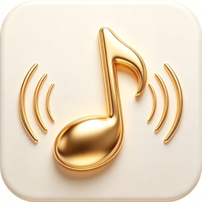

<div align="center">



# Mineradio Web

### 沉浸式音乐可视化播放器

将天气电台、搜索播放、歌词舞台、粒子视觉和 3D 歌单架融合为一个更接近现场感的私人音乐空间。

[](LICENSE)
[](https://nodejs.org)
[](public/manifest.json)
[](tests/)
[](../../pulls)

**在线 Demo**

[](https://mineradio-webapp.onrender.com/)
[](http://47.103.19.23:3000/app)

</div>

---

## 截图预览

<div align="center">
  <table>
    <tr>
      <td align="center"><b>Landing Page</b></td>
      <td align="center"><b>播放器主界面</b></td>
    </tr>
    <tr>
      <td></td>
      <td></td>
    </tr>
  </table>
</div>

---

## 核心功能

| 功能 | 说明 |
|:---:|:---|
| 🎵 **双音乐源** | 网易云音乐 + QQ 音乐，支持搜索、播放、扫码登录同步歌单 |
| ✨ **粒子可视化** | Three.js 驱动的节拍粒子视觉系统，含 WebGL 降级方案 |
| 🌤️ **天气电台** | Open-Meteo 天气数据驱动智能播放队列生成 |
| 📝 **歌词舞台** | 实时歌词同步与粒子效果联动 |
| 🎛️ **3D 歌单架** | Three.js 3D 旋转歌单浏览界面 |
| 🖥️ **桌面歌词** | 独立悬浮窗歌词显示 |
| 📱 **PWA 支持** | Service Worker 离线缓存 + 可安装到桌面/主屏幕 |
| 🔌 **WebSocket** | 手动实现 RFC 6455 协议，实时在线人数推送 |
| 🔐 **多用户会话** | AsyncLocalStorage Cookie 隔离 |
| 🥁 **节拍分析** | 离线音频节拍检测与节拍图缓存 |

---

## 技术架构

### 后端

```
Node.js 18+ (原生 http 模块，零框架依赖)
├── 音乐 API          网易云社区逆向 API + QQ 音乐 Web API
├── WebSocket         手动实现 RFC 6455（帧解析 + 掩码 + ping/pong）
├── 会话管理          AsyncLocalStorage 多用户 Cookie 隔离
├── 安全防护          SSRF 白名单 / CSP / HSTS / 速率限制
└── 节拍分析          自研 dj-analyzer.js（WASM 音频解码 + 节拍检测）
```

### 前端

```
Three.js r128 (粒子系统 + 3D 歌单架 + WebGL 降级)
├── GSAP              高性能动画引擎
├── mpg123-decoder    WASM MP3 解码器
├── Service Worker    离线缓存 + PWA 安装
└── Responsive        移动端 / 平板 / 桌面断点适配
```

### 工程化

```
Jest (32 项单元测试，覆盖安全/缓存/Cookie)
ESLint + Prettier + EditorConfig (代码规范)
GitHub Actions CI (语法检查 + Lint + 测试)
Docker (多阶段构建，非 root 运行)
```

---

## 快速开始

### 环境要求

```
Node.js >= 18
npm >= 9
```

### 本地运行

```bash
# 克隆仓库
git clone https://github.com/ElijahZhao/mineradio-WebAPP.git
cd mineradio-WebAPP

# 安装依赖
npm install

# 启动开发服务器
npm start
```

浏览器打开 `http://localhost:3000`，点击「访问网页版」进入播放器。

### Docker 部署

```bash
docker build -t mineradio-web .
docker run -p 3000:3000 mineradio-web
```

---

## 测试

```bash
# 运行全部测试
npm test

# 带覆盖率报告
npm run test:coverage
```

| 测试文件 | 覆盖内容 | 用例数 |
|:---|:---|:---:|
| `tests/security.test.js` | SSRF 防护白名单、私网拦截、子串绕过、协议过滤 | 17 |
| `tests/beatmap-cache.test.js` | 节拍缓存读写、LRU 淘汰、边界条件 | 8 |
| `tests/cookie-security.test.js` | Cookie 安全标志（HttpOnly / Secure / SameSite） | 7 |

---

## 项目结构

```
mineradio-WebAPP/
├── server.js                 # 后端入口（路由 + API + WebSocket + 安全防护）
├── dj-analyzer.js            # 音频节拍分析模块
├── public/
│   ├── landing.html          # 初始页面（Three.js 粒子背景）
│   ├── index.html            # 播放器本体（26000+ 行）
│   ├── desktop-lyrics.html   # 桌面悬浮歌词
│   ├── wallpaper.html        # 壁纸模式
│   ├── manifest.json         # PWA 清单
│   ├── sw.js                 # Service Worker
│   ├── icons/                # PWA 图标（192/256/512 + favicon）
│   ├── vendor/               # 第三方库（Three.js / GSAP / music-tempo）
│   └── assets/               # 静态资源（粒子模型等）
├── tests/                    # Jest 单元测试
├── .github/workflows/ci.yml  # GitHub Actions CI
├── Dockerfile                # Docker 多阶段构建
├── .eslintrc.js              # ESLint 配置
├── .prettierrc               # Prettier 配置
└── .editorconfig             # 编辑器格式配置
```

---

## API 路由

| 路由 | 方法 | 说明 |
|:---|:---:|:---|
| `/` | `GET` | 初始页面（Landing Page） |
| `/app` | `GET` | 播放器本体 |
| `/api/health` | `GET` | 健康检查 |
| `/api/search` | `GET` | 网易云音乐搜索 |
| `/api/qq/search` | `GET` | QQ 音乐搜索 |
| `/api/login/qr/*` | `GET` | 网易云扫码登录 |
| `/api/qq/qr/*` | `GET` | QQ 音乐扫码登录 |
| `/api/audio` | `GET` | 音频代理（SSRF 白名单保护） |
| `/api/cover` | `GET` | 封面代理（SSRF 白名单保护） |
| `/api/podcast/dj-beatmap` | `GET` | 节拍分析（SSRF 白名单保护） |
| `/api/beatmap/cache` | `GET` / `POST` | 节拍图缓存读写 |
| `/ws` | `WS` | WebSocket 在线人数推送 |

---

## 安全特性

本项目实现了多层安全防护：

- **SSRF 防护** — 代理目标白名单（仅允许 `music.126.net` / `music.163.com` / `*.qq.com`），拦截私网 IP、云元数据端点、非 HTTP(S) 协议、子串绕过攻击
- **速率限制** — 基于 IP 的 API 请求频率限制（300 次/分钟），静态资源不受限
- **安全响应头** — HSTS、X-Content-Type-Options、X-Frame-Options、Referrer-Policy、CSP
- **Cookie 安全** — HttpOnly + SameSite=Lax + Secure（生产环境）
- **WebSocket 安全** — Origin 校验、帧大小限制（1MB）、缓冲区上限、pong 死连接检测
- **请求体限制** — API 请求体 8MB 上限，日志端点 64KB 上限
- **会话隔离** — AsyncLocalStorage 多用户 Cookie 隔离

---

## 开源协议

本项目基于 [GPL-3.0](LICENSE) 协议开源，基于 [XxHuberrr/Mineradio](https://github.com/XxHuberrr/Mineradio) 的 Web 移植。

---

## 致谢

- **原作者** — [XxHuberrr](https://github.com/XxHuberrr) — Mineradio 桌面版
- **Three.js** — WebGL 3D 图形库
- **GSAP** — 高性能动画引擎
- **music-tempo** — 音频节拍检测
- **NeteaseCloudMusicApi** — 网易云音乐 API 社区封装
